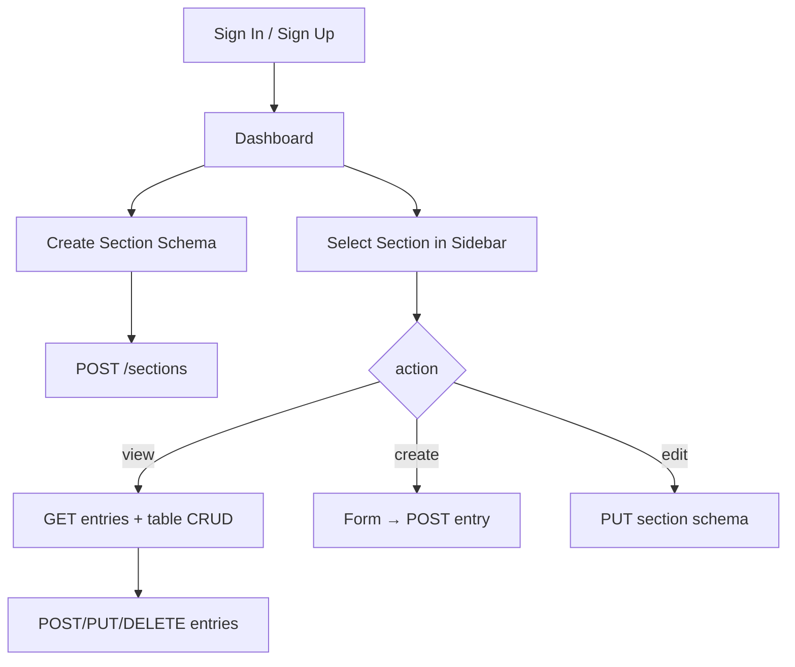

# AnyIT Institute CMS — Project Context for AI Sessions

Use this document as the primary onboarding reference when working in this repository. It describes purpose, architecture, data models, APIs, frontend flows, and conventions.

---

## 1. What this project is

**AnyIT Institute CMS** is a small full-stack **content management system** where authenticated users can:

1. **Define dynamic sections** — custom “schemas” with named fields (labels, types, grid layout, validation options).
2. **Store entries** — rows of data keyed by each field’s `id` (UUID strings), scoped per user and per section.
3. **Manage data** — list, create, edit, and delete entries through a React dashboard.

There is **no public-facing website** in this repo; it is an **admin dashboard** only (`/dashboard` after login).

---

## 2. Repository layout

```
anyit-institute-cms/
├── backend/                 # Node.js + Express + MongoDB (CommonJS)
│   ├── .env.example
│   ├── package.json
│   └── src/
│       ├── server.js        # App entry, Mongo connect, route mounting
│       ├── middleware/authMiddleware.js
│       ├── models/          # User, Section, SectionEntry
│       ├── routes/          # authRoutes, sectionRoutes
│       └── seed/            # seedUser, seedSections, seedAll, schoolSectionSpecs, fieldHelpers
├── frontend/                # React 19 + TypeScript + Vite (ESM)
│   ├── .env.example
│   ├── package.json
│   └── src/
│       ├── main.tsx         # Redux Provider, MUI ThemeProvider
│       ├── router/AppRouter.tsx
│       ├── pages/           # SignIn, SignUp, Dashboard
│       ├── components/      # Builder, Editor, Viewer, Sidebar
│       ├── features/        # Redux slices (auth, sections, sectionData)
│       ├── services/api.ts
│       └── types.ts
└── PROJECT_CONTEXT.md       # This file
```

There is **no root `package.json`** — run backend and frontend separately.

---

## 3. Tech stack

| Layer | Technologies |
|--------|----------------|
| **Backend** | Node.js, Express 5, Mongoose 9, MongoDB, JWT, bcryptjs, express-validator, cors, dotenv |
| **Frontend** | React 19, TypeScript, Vite 8, Redux Toolkit, React Router 7, MUI 9 |
| **Tests** | Playwright (e2e: `frontend/tests/auth.spec.ts`), Vitest configured in `vite.config.ts` (minimal unit tests) |

---

## 4. Running locally

**Prerequisites:** Node.js, MongoDB running locally (default URI below).

### Backend

```bash
cd backend
cp .env.example .env   # edit JWT_SECRET, MONGO_URI if needed
npm install
npm run dev            # nodemon on port 5000
```

Seed admin user and predefined sections:

```bash
npm run seed          # user + sections + sample entries (recommended)
npm run seed:user     # admin user only
npm run seed:sections # sections + entries (creates user if missing)
```

Default login: `admin@anyit.com` / `Admin@123`

**School CMS seed** (49 sections, DynamicSectionBuilder-compatible fields + `relation` cross-section links): `students`, `parents`, `staff`, `departments`, `designations`, `classes`, `sections`, `subjects`, attendance, fees, transport, library, inventory, hostel, etc. Specs: `backend/src/seed/schoolSectionSpecs.js`. Run `npm run seed` to **wipe all sections/entries** and recreate.

### Frontend

```bash
cd frontend
cp .env.example .env   # VITE_API_URL=http://localhost:5000/api
npm install
npm run dev            # Vite dev server (default 5173)
```

### Health check

`GET http://localhost:5000/api/health` → `{ "ok": true }`

---

## 5. Environment variables

### Backend (`backend/.env`)

| Variable | Default / purpose |
|----------|-------------------|
| `PORT` | `5000` |
| `MONGO_URI` | `mongodb://127.0.0.1:27017/anyit_cms` |
| `JWT_SECRET` | Required in production; fallback `change_this_secret` in code |
| `SEED_USER_*` | Used by `npm run seed:user` only |

### Frontend (`frontend/.env`)

| Variable | Default |
|----------|---------|
| `VITE_API_URL` | `http://localhost:5000/api` |

---

## 6. Authentication

- **Sign up:** `POST /api/auth/signup` — `{ name, email, password }` (password min 6).
- **Sign in:** `POST /api/auth/signin` — `{ email, password }`.
- **Response:** `{ token, user: { id, name, email } }`.
- **JWT:** 1 day expiry; payload `{ id, email }` (note: `id` is Mongo `_id`).
- **Protected routes:** `Authorization: Bearer <token>` via `authMiddleware`.
- **Frontend:** token stored in `localStorage` key `token`; Redux `auth` slice; `ProtectedRoute` redirects to `/signin` if no token.

All `/api/sections/*` routes require auth. Sections and entries are **scoped to `req.user.id`**.

---

## 7. Data models (MongoDB)

### User (`backend/src/models/User.js`)

- `name`, `email` (unique, lowercase), `password` (bcrypt hash), timestamps.

### Section (`backend/src/models/Section.js`)

Defines a **dynamic form schema** owned by a user:

- `name` (string)
- `userId` (ObjectId → User)
- `fields[]` — each field:
  - `id` (string, client-generated UUID)
  - `label`, `grid` (1–12), `type`, `required`
  - Optional: `min`, `max`, `minDate`, `maxDate`, `options[]`
  - **Relation fields only:** `targetSection`, `displayFields[]`, `valueField`, `multiple`
- **Field types (enum):** `input`, `textarea`, `number`, `datepicker`, `profile_upload`, `select`, `relation`

### SectionEntry (`backend/src/models/SectionEntry.js`)

Stores **one row of user-submitted data** for a section:

- `sectionId`, `userId`
- `data` — Mongoose `Map<string, Mixed>`; keys are **field `id`s**, values are arbitrary (strings, numbers, etc.)
- Compound index on `(sectionId, userId)`

**Important API shape:** When entries are returned, the backend **flattens** `data` into the JSON object:

```json
{
  "_id": "...",
  "sectionId": "...",
  "<fieldId>": "value",
  "createdAt": "...",
  "updatedAt": "..."
}
```

The frontend `SectionEntry` type in `types.ts` documents a nested `data` object, but **runtime API responses are flat**. Components like `SectionDataViewer` expect flat rows (`row[field.id]`).

---

## 8. API reference

Base URL: `{VITE_API_URL}` → typically `http://localhost:5000/api`

### Auth (public)

| Method | Path | Body |
|--------|------|------|
| POST | `/auth/signup` | `{ name, email, password }` |
| POST | `/auth/signin` | `{ email, password }` |

### Sections (auth required)

| Method | Path | Description |
|--------|------|-------------|
| GET | `/sections` | List current user’s sections (newest first); each includes `entryCount` |
| POST | `/sections` | Create section `{ name, fields }` — `fields` array min length 1 |
| PUT | `/sections/:sectionId` | Update `{ name, fields }` |
| DELETE | `/sections/:sectionId` | Delete section **only if it has zero entries** (409 if records exist) |
| GET | `/sections/:sectionId/entries` | List entries (flattened) |
| POST | `/sections/:sectionId/entries` | Create entry — **body is flat field map** (field id → value), not wrapped in `data` |
| PUT | `/sections/:sectionId/entries/:entryId` | Update entry (same flat body) |
| DELETE | `/sections/:sectionId/entries/:entryId` | Delete entry |

**Not implemented:** get single section by id, pagination, file upload storage (see gaps below).

Errors often return `{ message, errors? }` with HTTP 400/401/404/409/500.

---

## 9. Frontend architecture

### Entry (`frontend/src/main.tsx`)

- Redux `Provider` + MUI `ThemeProvider` + `CssBaseline`
- Renders `App` → `AppRouter`

### Routing (`frontend/src/router/AppRouter.tsx`)

| Path | Page | Guard |
|------|------|-------|
| `/signin` | SignInPage | Public |
| `/signup` | SignUpPage | Public |
| `/dashboard` | DashboardPage | `ProtectedRoute` (needs token) |
| `*` | Redirect to `/signin` | |

### State (Redux Toolkit)

| Slice | File | Responsibility |
|-------|------|----------------|
| `auth` | `features/authSlice.ts` | signIn, signUp, signOut; token + user |
| `sections` | `features/sectionSlice.ts` | fetchSections, createSection, updateSection |
| `sectionData` | `features/sectionDataSlice.ts` | CRUD entries; `entries` keyed by `sectionId` |

Typed hooks: `useAppDispatch`, `useAppSelector` in `hooks.ts`.

### API client (`services/api.ts`)

- `apiRequest<T>(path, { method, body, token })`
- Prefixes `VITE_API_URL`; sets `Content-Type: application/json` and optional `Authorization: Bearer`

### Dashboard UX (`pages/DashboardPage.tsx`)

URL query params drive UI (not path segments):

- No `sectionName` → show **DynamicSectionBuilder** (create new section schema).
- `?sectionName=<name>&action=view` → **SectionDataViewer** (table + dialog CRUD).
- `?sectionName=<name>&action=create` → **SectionDataViewer** inline create form.
- `?sectionName=<name>&action=edit` → **SectionEditor** (edit schema).

**Section lookup uses `name` string**, not `_id`. Renaming a section updates the URL when returning to view mode.

### Key components

| Component | Role |
|-----------|------|
| `DynamicSectionBuilder` | Create section schema; default name `'user'`; fields use `crypto.randomUUID()` |
| `SectionEditor` | Edit existing section name/fields |
| `SectionDataViewer` | Render dynamic fields; table for `view`; dialog for add/edit; loads relation targets |
| `RelationFieldSelect` | MUI Autocomplete (searchable) for `relation` fields; single or multiple |
| `RelationFieldSettings` | UI in builder/editor to configure link target, display fields, stored value |
| `Sidebar` | Accordion per section: View Data / Create Entry / Edit Section |

### Shared types (`types.ts`)

- `DynamicField`, `Section`, `SectionEntry`, `User`, `FieldType`
- Relation fields extend `DynamicField` with `targetSection?`, `displayFields?`, `valueField?`, `multiple?`

### Relation fields (cross-section dropdowns)

**Purpose:** Show a searchable dropdown on one section’s form whose options come from **entries in another section** (e.g. pick teachers/students when creating an event). Options are **not hardcoded** — they are loaded at runtime from the linked section’s data.

**How it works:**

1. Field `type` is `relation` with `targetSection` set to the **name** of another section (e.g. `staff`, `students`, `notices`).
2. On open create/edit, `SectionDataViewer` finds that section’s `_id`, calls `GET /sections/:sectionId/entries`, and builds options.
3. **Display label** is built from `displayFields` (comma-separated field ids on the target row), e.g. `firstName`, `lastName`.
4. **Stored value** is taken from `valueField` on the target row (e.g. `employeeCode`, `admissionNumber`, or `_id`).
5. If `multiple: true`, the saved value is a **string array**; otherwise a single string.

**Utilities:** `frontend/src/utils/relationField.ts` — label formatting, option building, table cell display.

**Seed:** `backend/src/seed/fieldHelpers.js` → `rel()` creates relation fields; tuple specs in `schoolSectionSpecs.js` use a 5th element for the target section name. Defaults for display/value fields are defined per target (e.g. `staff` → `firstName` + `lastName`, value `employeeCode`).

**Example (events section):** `organizerId` → `staff`; `teacherIds` / `studentIds` → multiple relations to `staff` and `students`.

---

## 10. End-to-end user flows



1. User authenticates → JWT in localStorage.
2. User builds a section (name + ≥1 field) → saved to MongoDB.
3. User opens section → **View Data** loads entries.
4. User adds/edits rows → values stored under each field’s `id` key.
5. User can **Edit Section** to change schema (existing entries may have orphan/extra keys).

---

## 11. File map (source only)

### Backend

| File | Purpose |
|------|---------|
| `server.js` | Express app, CORS, JSON, routes, Mongo connect |
| `middleware/authMiddleware.js` | JWT verify → `req.user` |
| `routes/authRoutes.js` | signup, signin |
| `routes/sectionRoutes.js` | sections + entries CRUD |
| `models/*.js` | Mongoose schemas |
| `seed/seedUser.js` | Admin user only |
| `seed/seedSections.js` | Predefined sections + entries |
| `seed/seedAll.js` | User + sections + entries |
| `seed/schoolSectionSpecs.js` | Full School CMS section/field/relation specs |
| `seed/sectionDefinitions.js` | Builds field arrays from specs (`buildField` + `rel()`) |
| `seed/fieldHelpers.js` | `field()`, `rel()`, `statusField()`, `defineSection()` |
| `seed/clearDatabase.js` | Deletes all sections and entries |

### Frontend

| File | Purpose |
|------|---------|
| `pages/DashboardPage.tsx` | Main CMS shell |
| `pages/SignInPage.tsx` / `SignUpPage.tsx` | Auth forms |
| `components/DynamicSectionBuilder.tsx` | New section builder |
| `components/SectionEditor.tsx` | Edit section schema |
| `components/SectionDataViewer.tsx` | Entry UI + dynamic field renderers + relation prefetch |
| `components/RelationFieldSelect.tsx` | Searchable relation dropdown |
| `components/RelationFieldSettings.tsx` | Configure relation fields in builder/editor |
| `components/Sidebar.tsx` | Section navigation |
| `utils/relationField.ts` | Relation label/options helpers |
| `features/*.ts` | Async thunks → API |
| `services/api.ts` | Fetch wrapper |
| `types.ts` | Shared TS interfaces |

---

## 12. Conventions for contributors / AI agents

- **Backend:** CommonJS (`require`/`module.exports`), no TypeScript.
- **Frontend:** TypeScript strict-ish; functional components; MUI for UI; Redux for server state.
- **Field IDs:** Generated on the client with `crypto.randomUUID()`; stable keys for entry `data` maps.
- **Grid layout:** MUI Grid v2 `size={{ xs: 12, md: field.grid }}` in forms.
- **Auth header:** Always pass `token` from `getState().auth.token` in thunks.
- **Minimal diffs:** Match existing patterns (slices + `apiRequest`, MUI forms, no extra abstractions unless needed).
- **Do not commit** `.env` files or real secrets.

---

## 13. Known gaps and quirks

Use these when debugging or extending features:

1. **Section delete** — allowed only when `entryCount === 0`; sidebar/Edit Section disable delete if records exist; API returns 409 otherwise.
2. **`profile_upload`** — UI uses `<input type="file">`; values are not uploaded to a server; File objects may not serialize well to JSON/Mongo.
3. **Entry type mismatch** — `types.ts` `SectionEntry.data` vs API flat objects; trust runtime flat shape.
4. **Section selection by name** — duplicate section names would confuse URL routing (names are not enforced unique).
5. **Update entry from dashboard** — `handleSaveData` strips `_id` from body before PUT; edit flow passes `_id` separately via `entryId`.
6. **JWT default secret** — insecure default in code if `JWT_SECRET` unset.
7. **No refresh token** — token expiry logs user out after 1 day.
8. **CORS** — wide open (`cors()` with defaults); fine for local dev.
9. **Tests** — only Playwright smoke test for sign-in page; no backend tests in repo.
10. **`DynamicSectionBuilder` Cancel button** — no handler wired.
11. **Relation fields** — no server-side validation that the stored value exists in the target section; orphan IDs show as raw values in the table if the target row is deleted.
12. **Relation target by section name** — `targetSection` must match the linked section’s `name` exactly; renaming a section breaks existing relation configs until updated in Edit Section.

---

## 14. Common tasks (quick recipes)

| Task | Where to change |
|------|-----------------|
| Add API endpoint | `backend/src/routes/*.js`, register in `server.js` |
| Add field type | `Section.js` enum + `types.ts` `FieldType` + builder/editor/viewer switch |
| Add relation field in **UI** | Section → **Edit** → Add Field → type `relation` → set link target, display fields, value field, multiple → **Update Section** |
| Add relation field in **seed** | `schoolSectionSpecs.js`: `[id, label, 'relation', { multiple?: true }, 'targetSectionName']` or any tuple with 5th element → `rel()` via `sectionDefinitions.js` |
| Link dropdown to notices/fees/etc. | Relation field → **Link to section:** `notices`, `fees`, or `notifications`; **Show in dropdown:** e.g. `title` or `title, message` |
| New page/route | `AppRouter.tsx`, new page under `pages/` |
| New global state | Redux slice in `features/`, register in `store.ts` |
| Change API base URL | `frontend/.env` `VITE_API_URL` |
| Seed user | `backend` → `npm run seed:user` |
| Reapply school schemas | `backend` → `npm run seed` (wipes sections/entries) |

---

## 15. Scripts reference

### Backend

- `npm run dev` — nodemon
- `npm start` — production node
- `npm run seed` — clear sections/entries, then recreate all School CMS sections + sample rows
- `npm run seed:clear` — delete sections and entries only
- `npm run seed:sections` — same as seed (clears then recreates)
- `npm run seed:user` — admin user only

### Frontend

- `npm run dev` — Vite dev
- `npm run build` — `tsc -b && vite build`
- `npm run lint` / `npm run format`
- `npm test` — Vitest
- `npm run e2e` — Playwright

---

## 16. Relation fields — UI and seed guide

### Add a relation field in the dashboard (no code)

1. Sidebar → select section (e.g. **events**) → **Edit Section** (not “Create Entry”).
2. **Add Field** (or edit existing).
3. **Choose Field** → `relation`.
4. Configure:
   - **Link to section** — e.g. `staff`, `students`, `notices`, `fees`
   - **Show in dropdown** — field ids from the target section, comma-separated (e.g. `firstName, lastName` or `title`)
   - **Stored value field** — what gets saved on this entry (e.g. `employeeCode`, `admissionNumber`, `_id`)
   - **Allow multiple selections** — for several teachers, students, notices, etc.
5. **Update Section**.
6. Ensure the **linked section has entries** (e.g. add staff first), then **View** → **Add New Entry** on this section.

Dropdown options update automatically when rows are added in the linked section (reopen the form or refresh entries).

### Add a relation field in seed

Tuple format in `schoolSectionSpecs.js`:

```js
// [fieldId, label, type, options, relationTargetSectionName]
['teacherIds', 'Teachers', 'relation', { multiple: true, grid: 12 }, 'staff'],
['feeNoticeId', 'Fee Notice', 'relation', { required: false }, 'notices'],
```

Any field with a **5th tuple element** is built via `rel()` in `fieldHelpers.js` (type `relation` + default display/value per target).

Optional overrides in the 4th argument:

```js
{
  multiple: true,
  displayFields: ['title', 'description'],
  valueField: '_id',
  required: true,
  grid: 12,
}
```

Then run `npm run seed` in `backend/` to recreate sections (clears existing section/entry data).

### `select` vs `relation`

| Type | Options from |
|------|----------------|
| `select` | Fixed list you type in Edit Section (comma-separated) |
| `relation` | Live rows from another section’s entries |

### Troubleshooting empty relation dropdowns

- Linked section has **no entries** yet.
- **Link to section** name does not match sidebar section name exactly.
- Section schema was created before relation fields were added — use **Edit Section** or re-seed.
- Wrong **Show in dropdown** field ids (must exist on target section rows).

---

## 17. Default credentials (development)

After `npm run seed:user` in backend (from `.env.example`):

- **Email:** `admin@anyit.com`
- **Password:** `Admin@123`

---

*Last updated: relation field type, cross-section dropdowns, `RelationFieldSettings` in builder/editor, events teacher/student links.*
