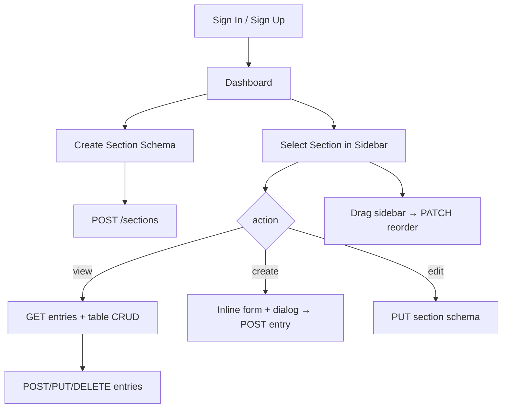

# AnyIT Institute CMS

A full-stack admin dashboard for defining dynamic content sections, storing entries, and managing data through a React UI.

**Package name (root `package.json`):** `anyit-institute-cms` · **Workspace folder:** `anyit-school-cms`

For AI-assisted development, see also [`PROJECT_CONTEXT.md`](./PROJECT_CONTEXT.md).

---

## 1. What this project is

**AnyIT Institute CMS** is a small full-stack **content management system** where authenticated users can:

1. **Define dynamic sections** — custom “schemas” with named fields (labels, types, grid layout, validation options).
2. **Store entries** — rows of data keyed by each field’s `id` (string keys, often camelCase from labels), scoped per user and per section.
3. **Manage data** — list, create, edit, and delete entries through a React dashboard.

There is **no public-facing website** in this repo; it is an **admin dashboard** only (`/dashboard` after login). There is no `/` route — unknown paths redirect to `/signin`.

---

## 2. Repository layout

```
anyit-school-cms/
├── package.json             # Root orchestration (concurrently)
├── README.md
├── PROJECT_CONTEXT.md       # Extended reference for AI sessions
├── .editorconfig, .prettierrc, .prettierignore
├── backend/
│   ├── .env.example
│   ├── eslint.config.cjs
│   ├── package.json
│   ├── scripts/
│   │   └── verify-build.cjs   # node --check all src/**/*.js
│   └── src/
│       ├── server.js
│       ├── middleware/authMiddleware.js
│       ├── models/            # User, Section, SectionEntry
│       ├── routes/            # authRoutes, sectionRoutes
│       └── seed/              # seedUser, seedSections, seedAll, specs, helpers
├── frontend/
│   ├── .env.example
│   ├── eslint.config.js
│   ├── package.json
│   ├── vite.config.ts         # Vite + Vitest config
│   ├── playwright.config.ts
│   ├── tests/auth.spec.ts
│   └── src/
│       ├── main.tsx
│       ├── App.tsx
│       ├── router/AppRouter.tsx
│       ├── pages/             # SignIn, SignUp, Dashboard
│       ├── components/        # Builder, Editor, Viewer, Sidebar, SectionFieldsEditor, Relation*
│       ├── features/          # auth, sections, sectionData slices
│       ├── utils/             # builderField, fieldKey, relationField, sectionOrder
│       ├── services/api.ts
│       ├── store.ts, hooks.ts, types.ts
│       └── index.css, App.css
```

Run backend and frontend **separately**, or from root: `npm run dev` (both via `concurrently`).

---

## 3. Tech stack

| Layer | Technologies |
|--------|----------------|
| **Backend** | Node.js, Express 5, Mongoose 9, MongoDB, JWT, bcryptjs, express-validator, cors, dotenv, ESLint, Prettier |
| **Frontend** | React 19, TypeScript, Vite 8, Redux Toolkit, React Router 7, MUI 9, @dnd-kit (drag-and-drop), ESLint, Prettier |
| **Root** | `concurrently` — run backend + frontend together |
| **Tests** | Playwright e2e (`frontend/tests/auth.spec.ts`); Vitest + jsdom configured in `vite.config.ts` but **no unit test files** yet |
| **Backend “build”** | ESLint + `node --check` syntax verification (no compile step) |

---

## 4. Running locally

**Prerequisites:** Node.js, MongoDB running locally (default URI below).

### From repository root (both apps)

```bash
npm install              # root devDeps (concurrently)
npm run install:all      # npm install in backend/ and frontend/
npm run dev              # backend :5000 + frontend :5173
```

Other root scripts: `dev:backend`, `dev:frontend`, `build`, `build:backend`, `build:frontend`, `start`, `start:backend`, `start:frontend`, `lint`, `lint:fix`, `format`, `format:check`.

### Backend

```bash
cd backend
cp .env.example .env   # edit JWT_SECRET, MONGO_URI if needed
npm install
npm run dev            # nodemon on port 5000
```

Seed admin user and predefined sections:

```bash
npm run seed          # wipe all sections/entries globally, ensure seed user, recreate specs
npm run seed:user     # admin user only (if missing)
npm run seed:sections # same wipe + recreate as seed by default
npm run seed:clear    # delete all sections and entries only (keeps users)
```

**Append without wipe:** `npm run seed:sections -- --no-reset` skips `deleteMany` on sections/entries.

Default login: `admin@anyit.com` / `Admin@123`

### Seed data (current state)

Specs live in `backend/src/seed/schoolSectionSpecs.js` → built by `sectionDefinitions.js` → consumed by `seedAll.js` / `seedSections.js`.

**Currently 1 section** is defined:

| Section | Fields | Sample entry |
|---------|--------|--------------|
| `users` | `roleId` (relation → `roles`), `username`, `email`, `password`, `status` (select), `lastLogin` (datepicker) | 1 row |

Notes:

- Tuple format: `[fieldId, label, type, options?, relationTarget?]`. A **5th element** (relation target section name) forces `rel()` even if the type string is `'input'`.
- `roleId` links to section name `roles`, but **`roles` is not seeded** — the relation dropdown is empty until that section exists.
- `fieldHelpers.js` defines `RELATION_DISPLAY_DEFAULTS` / `RELATION_VALUE_DEFAULTS` for many **future** targets (`staff`, `students`, `parents`, etc.) used when adding more specs.
- Seed wipe is **global** (`Section.deleteMany({})`, `SectionEntry.deleteMany({})`) — affects all users, not just the seed user.
- Seeded sections do not set `order` (all default `0`); sidebar order follows `createdAt` until manually reordered.
- At most **one sample entry** per section (third tuple element in `SECTION_SPECS`).

### Frontend

```bash
cd frontend
cp .env.example .env   # VITE_API_URL=http://localhost:5000/api
npm install
npm run dev            # Vite dev server (default 5173)
```

### Health check

`GET http://localhost:5000/api/health` → `{ "ok": true }` (no auth)

---

## 5. Environment variables

### Backend (`backend/.env`)

| Variable | Default / purpose |
|----------|-------------------|
| `PORT` | `5000` |
| `MONGO_URI` | `mongodb://127.0.0.1:27017/anyit_cms` |
| `JWT_SECRET` | Required in production; fallback `change_this_secret` in code |
| `SEED_USER_NAME` | `Admin User` — used by all seed scripts that ensure a user |
| `SEED_USER_EMAIL` | `admin@anyit.com` |
| `SEED_USER_PASSWORD` | `Admin@123` |

### Frontend (`frontend/.env`)

| Variable | Default |
|----------|---------|
| `VITE_API_URL` | `http://localhost:5000/api` (also hardcoded fallback in `api.ts`) |

---

## 6. Authentication

- **Sign up:** `POST /api/auth/signup` — `{ name, email, password }` (password min 6). **409** if email exists.
- **Sign in:** `POST /api/auth/signin` — `{ email, password }`. **401** invalid credentials.
- **Response:** `{ token, user: { id, name, email } }`.
- **JWT:** 1 day expiry; payload `{ id, email }` (note: `id` is Mongo `_id`).
- **Protected routes:** `Authorization: Bearer <token>` via `authMiddleware`.
- **Frontend:** token stored in `localStorage` key `token`; Redux `auth` slice; `ProtectedRoute` checks token only.
- **Page reload:** token is restored from `localStorage`, but **`user` stays `null`** until the user signs in or signs up again (no `/me` endpoint).

All `/api/sections/*` routes require auth. Sections and entries are **scoped to `req.user.id`**.

---

## 7. Data models (MongoDB)

### User (`backend/src/models/User.js`)

- `name` (trim), `email` (unique, lowercase, trim), `password` (bcrypt hash, minlength 6), timestamps.

### Section (`backend/src/models/Section.js`)

Defines a **dynamic form schema** owned by a user:

- `name` (string)
- `userId` (ObjectId → User)
- `order` (number, default `0`) — sidebar display order; updated via `PATCH /sections/reorder`
- `fields[]` — each field:
  - `id` (string) — data key for entries
  - `label`, `grid` (1–12), `type`, `required`
  - Optional: `min`, `max`, `minDate`, `maxDate`, `options[]`
  - **Relation fields only:** `targetSection`, `displayFields[]`, `valueField`, `multiple`
- **Field types (enum):** `input`, `textarea`, `number`, `datepicker`, `profile_upload`, `select`, `relation`

### SectionEntry (`backend/src/models/SectionEntry.js`)

Stores **one row of user-submitted data** for a section:

- `sectionId`, `userId`
- `data` — Mongoose `Map<string, Mixed>`; keys are **field `id`s**, values are arbitrary (strings, numbers, etc.)
- Compound index on `(sectionId, userId)`

**Important API shape:** When entries are returned, the backend **flattens** `data` into the JSON object:

```json
{
  "_id": "...",
  "sectionId": "...",
  "<fieldId>": "value",
  "createdAt": "...",
  "updatedAt": "..."
}
```

The frontend `SectionEntry` type in `types.ts` documents a nested `data` object, but **runtime API responses are flat**. Components like `SectionDataViewer` expect flat rows (`row[field.id]`).

---

## 8. API reference

Base URL: `{VITE_API_URL}` → typically `http://localhost:5000/api`

Route mounting (`server.js`): `/api/auth`, `/api/sections`, `/api/health`.

### Auth (public)

| Method | Path | Body / notes |
|--------|------|--------------|
| POST | `/auth/signup` | `{ name, email, password }` — 201 created, 409 email exists, 400 validation |
| POST | `/auth/signin` | `{ email, password }` — 401 invalid credentials |

### Sections (auth required)

| Method | Path | Description |
|--------|------|-------------|
| GET | `/sections` | List user’s sections (`order` asc, `createdAt` asc); each includes `entryCount` |
| POST | `/sections` | Create `{ name, fields }` — `fields` min length 1; assigns `order = max + 1` |
| PATCH | `/sections/reorder` | Body `{ orderedIds: string[] }`; validates ownership; sets `order` to index; returns sections **without** `entryCount` |
| GET | `/sections/:sectionId/entries` | List entries (flattened), newest first |
| PUT | `/sections/:sectionId` | Update `{ name, fields }` — no express-validator on body |
| DELETE | `/sections/:sectionId` | Delete section only if zero entries — **409** with `entryCount` if records exist |
| POST | `/sections/:sectionId/entries` | Create entry — **body is flat field map**, not wrapped in `data` |
| PUT | `/sections/:sectionId/entries/:entryId` | Replace entry `data` from flat body |
| DELETE | `/sections/:sectionId/entries/:entryId` | `{ message: 'Entry deleted successfully' }` |

**Not implemented:** `GET /sections/:sectionId` (single section), pagination, file upload storage.

Errors often return `{ message, errors? }` with HTTP 400/401/404/409/500.

---

## 9. Frontend architecture

### Entry (`frontend/src/main.tsx`)

- Redux `Provider` + MUI `ThemeProvider` + `CssBaseline`
- Renders `App` → `AppRouter`

### Routing (`frontend/src/router/AppRouter.tsx`)

| Path | Page | Guard |
|------|------|-------|
| `/signin` | SignInPage | Public |
| `/signup` | SignUpPage | Public |
| `/dashboard` | DashboardPage | `ProtectedRoute` (token in Redux/localStorage) |
| `*` | Redirect to `/signin` | |

### State (Redux Toolkit)

| Slice | File | Responsibility |
|-------|------|----------------|
| `auth` | `features/authSlice.ts` | `signIn`, `signUp`, `signOut`; token + user |
| `sections` | `features/sectionSlice.ts` | `fetchSections`, `createSection`, `updateSection`, `reorderSections`, `deleteSection`; `setSectionOrderOptimistic` |
| `sectionData` | `features/sectionDataSlice.ts` | Entry CRUD; `entries` keyed by `sectionId`; `clearSectionData` on section delete |

Typed hooks: `useAppDispatch`, `useAppSelector` in `hooks.ts`.

### API client (`services/api.ts`)

- `apiRequest<T>(path, { method, body, token })`
- Prefixes `VITE_API_URL`; sets `Content-Type: application/json` and optional `Authorization: Bearer`
- Throws `Error` with `data.message` on non-OK responses

### Dashboard UX (`pages/DashboardPage.tsx`)

URL query params drive UI (not path segments):

- No `sectionName` → **DynamicSectionBuilder** (create new section schema).
- `?sectionName=<name>&action=view` → **SectionDataViewer** (table + dialog CRUD); fetches entries.
- `?sectionName=<name>&action=create` → **SectionDataViewer** with inline create form **and** create dialog open on mount.
- `?sectionName=<name>&action=edit` → **SectionEditor** (edit schema).

**Section lookup uses `name` string**, not `_id`. Renaming a section updates the URL when returning to view mode. Sidebar sections sorted by `order` (drag handle to persist).

After entry create/update/delete, dashboard refetches sections to refresh `entryCount`.

### Key components

| Component | Role |
|-----------|------|
| `DynamicSectionBuilder` | Create section; default name `'user'`; `SectionFieldsEditor`; Cancel **unwired**; Reset Form works |
| `SectionEditor` | Edit name/fields; Cancel works; Delete Section when `entryCount === 0` |
| `SectionFieldsEditor` | Shared field builder: types, validation, relation settings, field DnD, label→key |
| `SectionDataViewer` | View table / inline create / dialog add-edit; relation target prefetch |
| `RelationFieldSelect` | MUI Autocomplete for `relation` fields |
| `RelationFieldSettings` | Configure relation in builder/editor; uses `suggestRelationDefaults` |
| `Sidebar` | Sortable section accordion: View / Create Entry / Edit Section / Delete |

### Shared types (`types.ts`)

- `DynamicField`, `Section`, `SectionEntry`, `User`, `FieldType`
- `Section` includes optional `order`, `entryCount`, timestamps
- Relation fields extend `DynamicField` with `targetSection?`, `displayFields?`, `valueField?`, `multiple?`

### Relation fields (cross-section dropdowns)

**Purpose:** Searchable dropdown whose options come from **entries in another section** at runtime.

**How it works:**

1. Field `type` is `relation` with `targetSection` = **name** of another section (e.g. `roles`, `staff`).
2. `SectionDataViewer` finds that section’s `_id`, calls `GET /sections/:sectionId/entries`, builds options.
3. **Display label** from `displayFields` (target row field ids).
4. **Stored value** from `valueField` on the target row (or `_id`).
5. `multiple: true` → saved value is a **string array**; else a single string.

**Utilities (`utils/relationField.ts`):** `buildRelationOptions`, `formatEntryLabel`, `normalizeRelationValue`, `formatRelationCellValue`, `suggestRelationDefaults`, `getRelationDisplayFieldChoices`, `getRelationValueFieldChoices`, `RELATION_ENTRY_ID`.

**Seed helpers (`fieldHelpers.js`):** `rel()` applies per-target defaults from `RELATION_DISPLAY_DEFAULTS` / `RELATION_VALUE_DEFAULTS` (e.g. `staff` → display `firstName, lastName`, value `employeeCode`).

**Current seed example:** `users.roleId` → relation to `roles` (target section not seeded yet).

### Drag-and-drop reorder

- **Sections (sidebar):** drag handle → optimistic Redux (`setSectionOrderOptimistic`) → `PATCH /sections/reorder`; on failure refetch + alert. Frontend preserves `entryCount` after reorder response.
- **Fields (builder/editor):** drag handle → local reorder only; persisted on section save.

### Field keys (`id`)

- Each field’s `id` is the **data key** in entry maps (not Mongo `_id`).
- New fields start with `id: ''` (`newBuilderField()`).
- Typing a **label** auto-fills `id` via `labelToFieldKey` when id is empty or UUID-shaped (`isAutoGeneratedFieldId`).
- Manual **Field key** override; whitespace stripped on input.
- `BuilderField` = `DynamicField` + `clientId` for stable DnD keys; stripped on submit (`toDynamicFields`).

---

## 10. End-to-end user flows



1. User authenticates → JWT in localStorage.
2. User builds a section (name + ≥1 field) → saved to MongoDB.
3. User opens section → **View Data** loads entries.
4. User adds/edits rows → values stored under each field’s `id` key.
5. User can **Edit Section** to change schema (existing entries may have orphan/extra keys).
6. User can drag sidebar sections to reorder (persisted server-side).

---

## 11. File map (source only)

### Backend

| File | Purpose |
|------|---------|
| `server.js` | Express app, CORS, JSON, routes, Mongo connect |
| `middleware/authMiddleware.js` | JWT verify → `req.user` `{ id, email }` |
| `routes/authRoutes.js` | signup (409 duplicate), signin |
| `routes/sectionRoutes.js` | sections CRUD, reorder, entries CRUD |
| `models/*.js` | Mongoose schemas |
| `scripts/verify-build.cjs` | Syntax-check all `src/**/*.js` |
| `seed/seedUser.js` | Admin user only if missing |
| `seed/seedSections.js` | Specs + entries; `--no-reset` flag |
| `seed/seedAll.js` | Wipe + user + specs (used by `npm run seed`) |
| `seed/clearDatabase.js` | Delete all sections and entries |
| `seed/schoolSectionSpecs.js` | `SECTION_SPECS` tuple definitions |
| `seed/sectionDefinitions.js` | Maps specs → `SECTION_DEFINITIONS` via `buildField` / `rel()` |
| `seed/fieldHelpers.js` | `field()`, `rel()`, `statusField()`*, `defineSection()`* |

\* `statusField` and `defineSection` exported but unused in current specs.

### Frontend

| File | Purpose |
|------|---------|
| `pages/DashboardPage.tsx` | CMS shell, URL state, reorder/delete handlers |
| `pages/SignInPage.tsx` / `SignUpPage.tsx` | Auth forms |
| `components/DynamicSectionBuilder.tsx` | New section builder shell |
| `components/SectionEditor.tsx` | Edit section + delete |
| `components/SectionFieldsEditor.tsx` | Shared field list with DnD |
| `components/SectionDataViewer.tsx` | Entry table, inline create, dialog CRUD |
| `components/RelationFieldSelect.tsx` | Searchable relation dropdown |
| `components/RelationFieldSettings.tsx` | Relation config in builder/editor |
| `components/Sidebar.tsx` | Sortable section nav + delete |
| `utils/builderField.ts` | `BuilderField`, create/convert/reorder helpers |
| `utils/fieldKey.ts` | `labelToFieldKey`, `isAutoGeneratedFieldId` |
| `utils/sectionOrder.ts` | `sortSectionsByOrder`, `reorderSectionList` |
| `utils/relationField.ts` | Relation labels, options, defaults |
| `features/*.ts` | Async thunks → API |
| `services/api.ts` | Fetch wrapper |
| `store.ts`, `hooks.ts`, `types.ts` | Redux store and shared types |
| `tests/auth.spec.ts` | Playwright: sign-in page renders |

---

## 12. Conventions for contributors

- **Backend:** CommonJS (`require`/`module.exports`), no TypeScript. `npm run build` = lint + syntax check.
- **Frontend:** TypeScript; functional components; MUI for UI; Redux for server state.
- **Field IDs:** Prefer human-readable camelCase keys from labels; stable once saved — entry maps keyed by field `id`.
- **Grid layout:** MUI Grid v2 `size={{ xs: 12, md: field.grid }}` in forms.
- **Auth header:** Pass `token` from `getState().auth.token` in thunks.
- **Minimal diffs:** Match existing patterns (slices + `apiRequest`, MUI forms).
- **Do not commit** `.env` files or real secrets.

---

## 13. Known gaps and quirks

1. **Section delete** — only when `entryCount === 0`; UI disables delete; API **409** otherwise.
2. **`profile_upload`** — `<input type="file">`; no server upload; File objects don’t serialize to JSON well.
3. **Entry type mismatch** — `types.ts` nested `data` vs flat API; trust runtime flat shape.
4. **Section selection by name** — duplicate names break URL routing (not enforced unique).
5. **Update entry** — `handleSaveData` strips `_id` from PUT body; `entryId` passed separately.
6. **JWT default secret** — insecure fallback if `JWT_SECRET` unset.
7. **No refresh token / no `/me`** — token expires in 1 day; reload keeps token but `user` is null.
8. **CORS** — open defaults; fine for local dev.
9. **Tests** — one Playwright smoke test; Vitest configured but zero unit tests; no backend tests.
10. **`DynamicSectionBuilder` Cancel** — no `onClick` (Reset Form works; `SectionEditor` Cancel works).
11. **`action=create` UX** — inline create form **and** dialog both shown (dialog opens on mount).
12. **Section reorder** — PATCH response lacks `entryCount`; slice merges previous counts; failed reorder refetches.
13. **Relation fields** — no server validation; orphan values show raw in table; renaming target section breaks links.
14. **Seed `roleId`** — relation to `roles` but `roles` section not in specs; dropdown empty after seed.
15. **Global seed wipe** — `npm run seed` deletes **all** users’ sections/entries, not scoped per user.
16. **Seed section order** — all `order: 0` until manually reordered in UI.

---

## 14. Common tasks (quick recipes)

| Task | Where to change |
|------|-----------------|
| Add API endpoint | `backend/src/routes/*.js`, register in `server.js` |
| Add field type | `Section.js` enum + `types.ts` `FieldType` + `SectionFieldsEditor` / `SectionDataViewer` |
| Add relation field in **UI** | Edit Section → Add Field → `relation` → configure target, display, value, multiple |
| Add relation field in **seed** | `schoolSectionSpecs.js`: 5th tuple element = target section name → `rel()` |
| Add new seeded section | Add tuple to `SECTION_SPECS` in `schoolSectionSpecs.js`, run `npm run seed` |
| New page/route | `AppRouter.tsx`, new page under `pages/` |
| New global state | Redux slice in `features/`, register in `store.ts` |
| Change API base URL | `frontend/.env` `VITE_API_URL` |
| Seed user only | `backend` → `npm run seed:user` |
| Reapply seed (wipe) | `backend` → `npm run seed` |
| Append seed specs | `backend` → `npm run seed:sections -- --no-reset` |
| Reorder sidebar | Drag in `Sidebar` |
| Reorder fields | Drag in builder/editor → save section |

---

## 15. Scripts reference

### Root

| Script | Purpose |
|--------|---------|
| `install:all` | Install backend + frontend deps |
| `dev` / `dev:backend` / `dev:frontend` | Run dev servers |
| `build` / `build:backend` / `build:frontend` | Build both or one |
| `start` / `start:backend` / `start:frontend` | Build + run backend / Vite preview |
| `lint` / `lint:fix` | ESLint both packages |
| `format` / `format:check` | Prettier both packages |

### Backend

| Script | Purpose |
|--------|---------|
| `dev` | nodemon |
| `start` | `node src/server.js` |
| `build` | ESLint + `verify-build.cjs` |
| `seed` | Wipe sections/entries + user + specs |
| `seed:sections` | Same as seed by default; `-- --no-reset` to append |
| `seed:clear` | Delete sections/entries only |
| `seed:user` | Create admin if missing |
| `lint` / `lint:fix` / `format` / `format:check` | ESLint / Prettier |

### Frontend

| Script | Purpose |
|--------|---------|
| `dev` | Vite dev server |
| `build` | `tsc -b && vite build` |
| `preview` | Vite preview (used by root `start`) |
| `test` | Vitest run (no tests yet) |
| `test:watch` / `test:coverage` | Vitest watch / coverage |
| `e2e` | Playwright (starts Vite on 5173 if needed) |
| `lint` / `lint:fix` / `format` / `format:check` | ESLint / Prettier |

---

## 16. Relation fields — UI and seed guide

### Add a relation field in the dashboard (no code)

1. Sidebar → section → **Edit Section**.
2. **Add Field** → type `relation`.
3. Configure:
   - **Link to section** — exact sidebar section name (e.g. `roles`, `staff`)
   - **Show in dropdown** — target field ids, comma-separated
   - **Stored value field** — e.g. `roleName`, `employeeCode`, `_id`
   - **Allow multiple selections** — optional
4. **Update Section**.
5. Ensure the **linked section has entries**, then create entries on this section.

### Add a relation field in seed

Tuple format in `schoolSectionSpecs.js`:

```js
// [fieldId, label, type, options, relationTargetSectionName]
['roleId', 'Role', 'input', { required: true }, 'roles'],
['teacherIds', 'Teachers', 'relation', { multiple: true, grid: 12 }, 'staff'],
```

Any **5th tuple element** triggers `rel()` in `sectionDefinitions.js` (type becomes `relation` + defaults from `fieldHelpers.js`).

Optional overrides in the 4th argument:

```js
{
  multiple: true,
  displayFields: ['title', 'description'],
  valueField: '_id',
  required: true,
  grid: 12,
}
```

Then `npm run seed` (wipe) or `npm run seed:sections -- --no-reset` (append).

### `select` vs `relation`

| Type | Options from |
|------|----------------|
| `select` | Fixed list in Edit Section (comma-separated) |
| `relation` | Live rows from another section’s entries |

### Troubleshooting empty relation dropdowns

- Linked section has **no entries**.
- **Link to section** name mismatch (case-sensitive).
- Target section not created yet (e.g. seeded `users.roleId` → missing `roles`).
- Wrong **Show in dropdown** field ids.

---

## 17. Default credentials (development)

After `npm run seed:user` or any full seed (from `.env.example` defaults):

- **Email:** `admin@anyit.com`
- **Password:** `Admin@123`

---

*Last updated: synced with full project audit — see [`PROJECT_CONTEXT.md`](./PROJECT_CONTEXT.md) for the AI session reference.*
